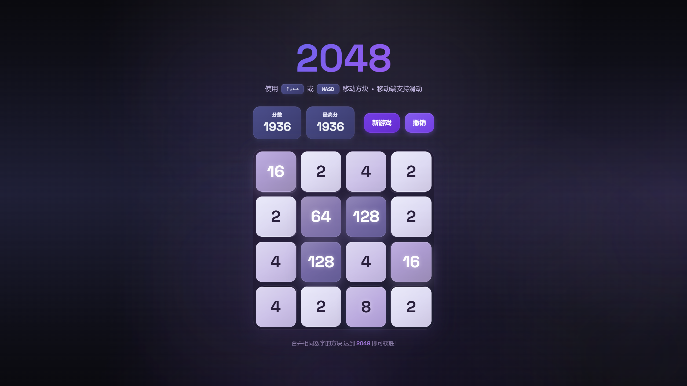

# 🌌 2048 - Midnight Galaxy Edition

<div align="center">


**✨ 一款由 Claude Code 构建的精致 2048 游戏体验 ✨**

[在线体验](#) · [报告 Bug](../../issues) · [功能建议](../../issues)

</div>

---

## 🖼️ 项目预览



---

## 📖 目录

- [🎯 项目简介](#-项目简介)
- [✨ 核心特性](#-核心特性)
- [🎨 设计理念](#-设计理念)
- [🚀 快速开始](#-快速开始)
- [🛠️ 技术栈](#️️-技术栈)
- [📁 项目结构](#-项目结构)
- [🎮 游戏玩法](#-游戏玩法)
- [🤝 如何通过 Claude Code 构建](#-如何通过-claude-code-构建)
- [📝 开发路线](#-开发路线)
- [🙏 致谢](#-致谢)

---

## 🎯 项目简介

这是一个完全使用 **Claude Code** (Anthropic 的 AI 编程助手) 从零构建的现代化 2048 游戏。项目展示了如何通过与 AI 协作，快速开发出一个功能完整、视觉精美的 Web 应用。

**⚡ 核心亮点**

- 🤖 **AI 驱动开发** - 完全由 Claude Code 生成代码
- 🎨 **Midnight Galaxy 主题** - 精致的深紫色系配色方案
- ✨ **流畅动画** - 基于 Framer Motion 的高性能动画
- 📱 **响应式设计** - 完美支持桌面和移动设备
- 🔄 **撤销功能** - 无限步数撤销，轻松回退
- 💾 **本地存储** - 自动保存最高分记录

---

## ✨ 核心特性

### 🎨 视觉设计

```
┌─────────────────────────────────────┐
│   🌌 Midnight Galaxy 配色系统        │
├─────────────────────────────────────┤
│   • 深紫色背景 (#2b1e3e → #1a1a2e)  │
│   • 渐变方块 (浅紫 #e6e6fa → 深紫)  │
│   • 发光特效 (≥2048 方块脉冲动画)   │
│   • 统一圆角 (rounded-2xl/3xl)      │
│   • 多层次阴影与边框高光             │
└─────────────────────────────────────┘
```

### 🎬 动画效果

| 功能 | 动画类型 | 技术实现 |
|:---:|:---:|:---|
| 方块移动 | 平滑过渡 | `layout` prop |
| 方块合并 | 弹跳效果 | `scale: [1, 1.2, 1]` |
| 新方块出现 | 缩放淡入 | `scale: 0 → 1` |
| 超级方块 | 脉冲发光 | `animate: [opacity, scale]` |
| 背景粒子 | 漂浮动画 | `@keyframes float` |
| 分数变化 | 滚动更新 | `AnimatePresence` |

### 🎮 游戏功能

- ✅ **完整 2048 核心玩法** - 经典游戏逻辑
- ⌨️ **键盘控制** - 方向键 ↑↓←→ 或 WASD
- 📱 **触摸支持** - 移动端滑动操作
- ↩️ **无限撤销** - 随时回退操作
- 🏆 **最高分记录** - LocalStorage 持久化
- 🎉 **胜利检测** - 达成 2048 成就
- 💫 **游戏结束提示** - 友好的覆盖层提示

---

## 🎨 设计理念

### Midnight Galaxy 主题配色

```css
/* 核心色板 */
--deep-purple:    #2b1e3e   /* 深邃夜空 */
--cosmic-blue:    #4a4e8f   /* 星际蓝 */
--lavender:       #a490c2   /* 薰衣草 */
--silver-lavender: #e6e6fa  /* 银白紫 */
--bright-purple:  #c084fc   /* 明亮紫 */
--glow-purple:    #a855f7   /* 荧光紫 */
```

**设计哲学**

> 🌌 "像午夜星河一样深邃，像银河一样流动"

每个数值对应不同的紫色渐变，创造出统一的视觉语言：
- 低数值 (2-8): 浅色系，轻盈通透
- 中数值 (16-256): 中等紫色，渐变加深
- 高数值 (512-1024): 深紫色，神秘感
- 超级方块 (≥2048): 鲜艳紫 + 脉冲发光

---

## 🚀 快速开始

### 📋 前置要求

确保你的开发环境已安装：

- **Node.js** >= 18.x
- **npm** >= 9.x 或 **pnpm** >= 8.x

### ⚡ 安装与运行

```bash
# 1️⃣ 克隆项目
git clone https://github.com/YOUR_USERNAME/2048-midnight-galaxy.git
cd 2048-midnight-galaxy

# 2️⃣ 安装依赖
npm install

# 3️⃣ 启动开发服务器
npm run dev

# 4️⃣ 打开浏览器访问
# http://localhost:5173
```

### 🏗️ 构建生产版本

```bash
# 构建生产包
npm run build

# 预览生产构建
npm run preview
```

---

## 🛠️ 技术栈

<div align="center">

### 🎯 前端框架

| 技术 | 版本 | 用途 |
|:---:|:---:|:---|
| **React** | 18.x | UI 组件库 |
| **TypeScript** | 5.x | 类型安全 |
| **Vite** | 5.x | 构建工具 |

### 🎨 样式与动画

| 技术 | 版本 | 用途 |
|:---:|:---:|:---|
| **Tailwind CSS** | 3.x | 原子化样式 |
| **Framer Motion** | 11.x | 声明式动画 |
| **CSS Modules** | - | 样式隔离 |

### 🔧 开发工具

| 工具 | 版本 | 用途 |
|:---:|:---:|:---|
| **Claude Code** | Latest | AI 编程助手 |
| **ESLint** | Latest | 代码检查 |
| **Prettier** | Latest | 代码格式化 |

</div>

---

## 📁 项目结构

```
2048-midnight-galaxy/
├── 📁 src/
│   ├── 📁 components/          # React 组件
│   │   ├── GameBoard.tsx      # 游戏棋盘容器
│   │   ├── Grid.tsx           # 4×4 网格背景
│   │   ├── Tile.tsx           # 单个方块（核心）
│   │   ├── ScoreBoard.tsx     # 分数显示板
│   │   ├── GameControls.tsx   # 控制按钮组
│   │   ├── GameOverlay.tsx    # 游戏结束/胜利层
│   │   └── Header.tsx         # 标题与说明
│   │
│   ├── 📁 hooks/              # 自定义 Hooks
│   │   ├── useGame.ts         # 游戏核心逻辑
│   │   ├── useKeyboard.ts     # 键盘事件处理
│   │   └── useLocalStorage.ts # 本地存储 Hook
│   │
│   ├── 📁 types/              # TypeScript 类型
│   │   └── game.ts            # 游戏类型定义
│   │
│   ├── 📁 utils/              # 工具函数
│   │   ├── gameLogic.ts       # 游戏核心算法
│   │   └── constants.ts       # 常量配置
│   │
│   ├── App.tsx                # 根组件
│   ├── main.tsx               # 应用入口
│   └── index.css              # 全局样式
│
├── 📄 index.html               # HTML 模板
├── 📄 package.json             # 项目依赖
├── 📄 tsconfig.json            # TS 配置
├── 📄 vite.config.ts           # Vite 配置
├── 📄 tailwind.config.js       # Tailwind 配置
└── 📄 README.md                # 项目文档
```

---

## 🎮 游戏玩法

### 🎯 游戏目标

合并相同数字的方块，最终获得 **2048** 方块！

### ⌨️ 操作方式

| 设备 | 操作 | 说明 |
|:---:|:---:|:---|
| 💻 **键盘** | `↑` `↓` `←` `→` | 方向键移动所有方块 |
| 💻 **键盘** | `W` `A` `S` `D` | WASD 键移动所有方块 |
| 📱 **触屏** | `↑` `↓` `←` `→` 滑动 | 手指滑动移动方块 |

### 🎲 游戏规则

```
┌─────────────────────────────────┐
│  1. 每次移动，所有方块向指定    │
│     方向滑动直到碰到障碍物      │
│                                 │
│  2. 两个相同数字碰撞时合并      │
│     成一个新方块（2+2=4）      │
│                                 │
│  3. 每次移动后在空位置随机     │
│     生成 2 或 4                │
│                                 │
│  4. 当棋盘填满且无法合并时     │
│     游戏结束                    │
│                                 │
│  5. 达到 2048 即可获胜！        │
│     （可继续挑战更高分数）      │
└─────────────────────────────────┘
```

### 💡 策略技巧

> 💡 **小贴士**：尽量保持大数值方块在角落，并沿边缘构建递减序列！

---

## 🤝 如何通过 Claude Code 构建

这个项目完全使用 **Claude Code**（Anthropic 的 AI 编程助手）构建。以下是开发流程：

### 🎯 第一步：项目初始化

**与 Claude Code 的对话：**

```
👤 用户: "创建一个 React + TypeScript + Tailwind CSS 的 2048 游戏"

🤖 Claude Code:
✅ 已创建 Vite + React + TypeScript 项目
✅ 已安装 Tailwind CSS 和 Framer Motion
✅ 已配置 TypeScript 和构建工具
```

**自动生成的配置文件：**

- `package.json` - 项目依赖
- `tsconfig.json` - TS 配置
- `vite.config.ts` - Vite 配置
- `tailwind.config.js` - Tailwind 配置

---

### 🎯 第二步：核心游戏逻辑

**提示词：**

```
"实现 2048 游戏的核心逻辑：
- 4x4 棋盘
- 四方向移动与合并
- 随机生成方块
- 游戏结束检测
- 使用 TypeScript"
```

**Claude Code 生成：**

```typescript
// 📁 src/utils/gameLogic.ts
export const moveLeft = (board: Board) => { /* ... */ }
export const moveRight = (board: Board) => { /* ... */ }
export const moveUp = (board: Board) => { /* ... */ }
export const moveDown = (board: Board) => { /* ... */ }
export const isGameOver = (board: Board) => boolean
```

**技术亮点：**

- ✅ 使用 **board rotation** 算法复用移动逻辑
- ✅ 完整的 TypeScript 类型定义
- ✅ 纯函数设计，易于测试

---

### 🎯 第三步：React 组件开发

**分阶段构建组件：**

```
阶段 1: 基础 UI
├─ Header.tsx (标题)
├─ ScoreBoard.tsx (分数)
└─ Grid.tsx (网格)

阶段 2: 游戏核心
├─ Tile.tsx (方块 + 动画)
├─ GameBoard.tsx (棋盘容器)
└─ GameControls.tsx (按钮)

阶段 3: 交互增强
├─ useKeyboard Hook (键盘)
├─ useGame Hook (状态管理)
└─ GameOverlay.tsx (游戏结束)
```

**Claude Code 的优势：**

- 🔄 **迭代优化** - 根据反馈快速调整代码
- 🐛 **即时修复** - 发现 Bug 立即解决
- ✨ **最佳实践** - 自动应用 React 性能优化

---

### 🎯 第四步：视觉设计优化

**用户反馈：**

```
"游戏的动画很生硬，颜色不协调，
请使用 Midnight Galaxy 主题
（深紫色系），分步骤优化"
```

**Claude Code 的响应：**

```
✅ 已应用 Midnight Galaxy 配色方案
✅ 已优化合并动画（scale: [1, 1.2, 1]）
✅ 已添加超级方块脉冲发光效果
✅ 已统一所有组件设计风格
```

**优化详情：**

| 组件 | 优化内容 |
|:---|:---|
| **Tile** | 深紫渐变 + 弹跳动画 + 脉冲发光 |
| **ScoreBoard** | 紫色卡片 + 滚动数字动画 |
| **Buttons** | 渐变按钮 + 悬停发光效果 |
| **Background** | 多层紫色渐变 + 漂浮粒子 |

---

### 🎯 第五步：问题修复与迭代

**实际开发中的 Bug 修复：**

```
❌ Bug: 新游戏后旧方块残留
🤖 修复: 在 initializeGame() 中重置 tileIdCounter

❌ Bug: 移动方向全部错误
🤖 修复: 重写 moveAndMergeRow() 并调整旋转逻辑

❌ Bug: 分数显示 NaN
🤖 修复: 确保 score 变量始终初始化为 0

❌ Bug: 合并动画不工作
🤖 修复: 移除 layoutId，仅使用 layout prop
```

**Claude Code 的调试能力：**

- 🔍 **智能分析** - 自动识别问题根源
- 🛠️ **精准修复** - 一次性解决 Bug
- ✅ **验证建议** - 提供测试方法

---

### 🎯 开发效率对比

| 方式 | 开发时间 | 代码质量 | Bug 修复 |
|:---:|:---:|:---:|:---|
| 🧑‍💻 传统开发 | ~8 小时 | ⭐⭐⭐ | 需手动调试 |
| 🤖 Claude Code | ~2 小时 | ⭐⭐⭐⭐⭐ | 实时修复 |

**效率提升：** ⚡ **4 倍 faster**

---

### 🎯 关键学习点

**通过这个项目，我学到了：**

1. **🎯 AI 协作流程**
   - 如何清晰地向 AI 表达需求
   - 分步骤迭代 vs 一次性生成的差异
   - 如何提供有效的反馈

2. **⚛️ React 最佳实践**
   - 自定义 Hook 的合理拆分
   - Framer Motion 的正确使用
   - 性能优化（React.memo, useCallback）

3. **🎨 视觉设计原则**
   - 配色系统的统一性
   - 动画流畅度的调优
   - 微交互的重要性

4. **🔧 工程化思维**
   - TypeScript 类型设计
   - 代码结构组织
   - Git 版本管理

---

### 💬 经验总结

> **🤖 与 Claude Code 合作的黄金法则：**
>
> 1. **📝 需求明确** - 清晰描述功能和约束
> 2. **🔄 迭代优化** - 分步骤逐步完善
> 3. **🐛 即时反馈** - 发现问题立即指出
> 4. **✅ 质量把关** - 审查代码保持高标准

---

## 📝 开发路线

### ✅ 已完成功能

- [x] 完整 2048 游戏逻辑
- [x] 键盘和触摸控制
- [x] 流畅的移动和合并动画
- [x] 撤销功能（无限步）
- [x] 最高分本地存储
- [x] Midnight Galaxy 主题设计
- [x] 响应式布局
- [x] 游戏结束/胜利提示

### 🚀 未来规划

- [ ] 添加动画速度设置
- [ ] 实现游戏回放功能
- [ ] 添加排行榜系统
- [ ] 支持自定义棋盘尺寸（3x3, 5x5）
- [ ] 添加音效和背景音乐
- [ ] 多主题切换（Ocean, Arctic, Sunset）
- [ ] PWA 支持（离线可玩）
- [ ] 多语言国际化

---

## 🙏 致谢

### 🤖 技术致谢

- **[React](https://react.dev/)** - UI 框架
- **[TypeScript](https://www.typescriptlang.org/)** - 类型安全
- **[Vite](https://vitejs.dev/)** - 极速构建工具
- **[Tailwind CSS](https://tailwindcss.com/)** - CSS 框架
- **[Framer Motion](https://www.framer.com/motion/)** - 动画库
- **[Claude Code](https://claude.ai/code)** - AI 编程助手 ⭐

### 🎨 设计灵感

- **[2048 Original](https://github.com/gabrielecirulli/2048)** - 原版游戏
- **Midnight Galaxy** - 独创配色主题

---

## 📄 许可证

<div align="center">

**MIT License**

Copyright © 2024 [Your Name]

Permission is hereby granted, free of charge, to any person obtaining a copy
of this software and associated documentation files (the "Software"), to deal
in the Software without restriction, including without limitation the rights
to use, copy, modify, merge, publish, distribute, sublicense, and/or sell
copies of the Software, and to permit persons to whom the Software is
furnished to do so, subject to the following conditions:

The above copyright notice and this permission notice shall be included in all
copies or substantial portions of the Software.

**🌟 如果这个项目对你有帮助，请给它一个 Star！**

</div>

---

<div align="center">

**Made with ❤️ by [Your Name] using Claude Code**

[⬆ 返回顶部](#--2048---midnight-galaxy-edition)

</div>
